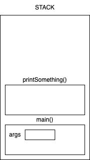

# Control structures in Java

1. Sequence (of execution)

    - By default the code gets executed from top to bottom, starting from the main() method
    - We can change the sequence by creating methods (or functions) and calling the same.

    ```
        [access-modifier] <return-type> <method-name>([param1, param2, ...]) {
            // method body
            [return] [return-value];
        }
    ```

    For example,

    ```java
        public long square(int n) {
            return n*n;
        }
        void sayHello() {
            System.out.println("Hello, world!");
        }
        public void setAge(int age){
            if(age<1 || age>120){
                System.err.println("Invalid value for age - " + age);
                return;
            }
            this.age=age;
        }
    ```

    

1. Selection

    - Allows conditional execution of code
    - `if-else` and `switch-case`

    ```java
        if(condition) {
            statements;
        }

        if(condition) {
            statements;
        }
        else {
            statements;
        }

        // nesting of if statements
        if(condition) {
            statements;
            if(condition) {
                statements;
                if(condition) {
                    statements;
                }
            }
        }

        // chain of if statements
        if(condition1) {
            statements1;
        }
        else if(condition2) {
            statements2;
        }
        else if(condition3) {
            statements3;
        }
        else {
            statements4;
        }

        // I generally avoid the above, and use this instead:
        if(condition1){
            statements1;
            return;
        }
        if(condition2){
            statements2;
            return;
        }
        if(condition3){
            statements3;
            return;
        }
        statements4;
        // assuming that there is no code to be executed after the if-else statements
    ```

1. Iteration
